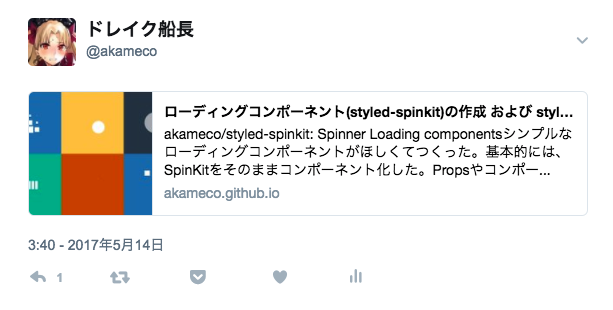

Reaact Helmetを使ってこのブログのOGP対応した。

[nfl/react-helmet: A document head manager for React](https://github.com/nfl/react-helmet)

OGP対応するとtwitterとかfacebookとかslackとかでいい感じに展開してくれて、イケてる感じになる。
まあwebで記事を書くなら必須だろう。



このブログはReactを使って書かれているのでOGP対応がちょいめんどい。
しかし、React Helmetを使って簡単に可能できた。

gatsby.jsだとwrappers/md.jsに以下を追記した。

```js
<Helmet
	title={title}
	meta={[
		{ name: 'description', content: description },
		{ property: 'og:title', content: post.title },
		{ property: 'og:type', content: 'blog' },
		{ property: 'og:url', content: postUrl },
		{ property: 'og:image', content: post.image || config.ogImage },
		{ property: 'og:description', content: description },
		{ name: 'twitter:card', content: 'summary' },
		{ name: 'twitter:site', content: '@akameco' },
	]}
/>
```

OGPについては以下のサイトが参考になった。

[Facebook・TwitterのOGP設定方法まとめ｜ferret [フェレット]](https://ferret-plus.com/610)

また、上記のdescriptionだけど、文字数制限があるので雑に以下のようにした。

```js
    const description =
      striptags(post.body).replace(/\r?\n/g, '').slice(0, 120) + '...'
```

[striptags](https://github.com/ericnorris/striptags)を使ってpost.bodyとして渡ってきたjsxをパースして文字列に変換して最後に...を追加してる。
この辺は文字数オーバーしてると自動で付けてくれるっぽいので必要ないかもしれない。
